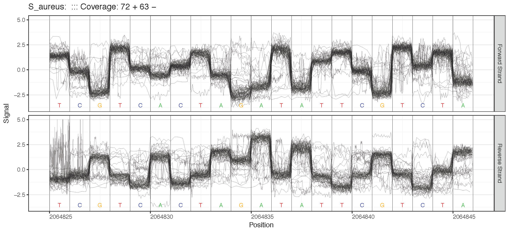
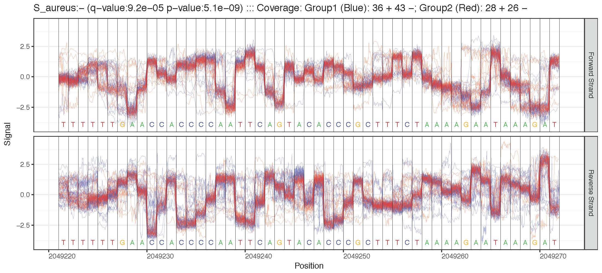
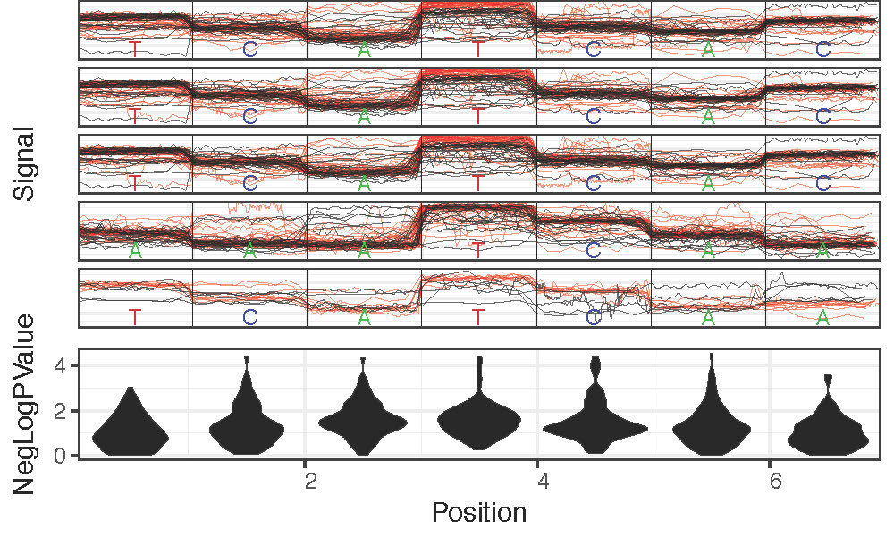
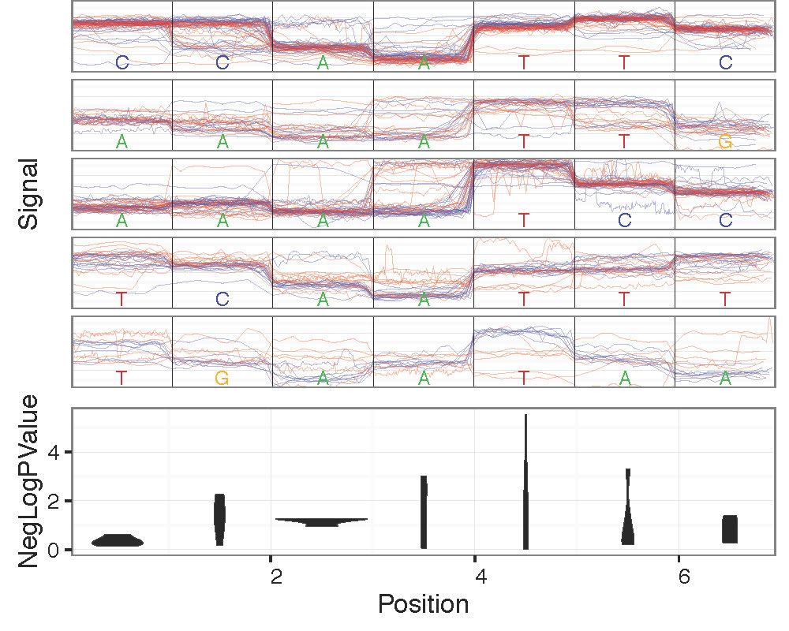
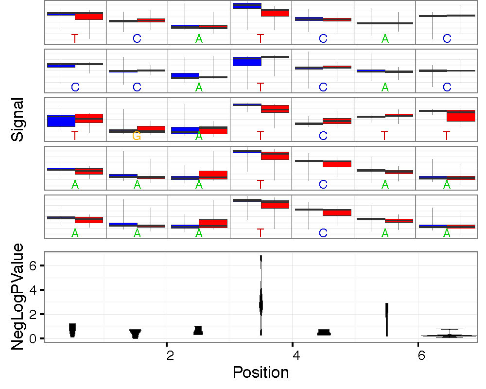
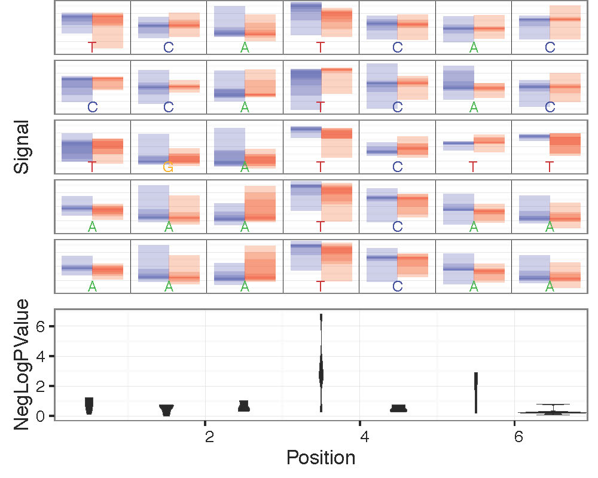

Genome Anchored Plotting Commands
*********************************

Single Sample Plotting
----------------------

   
   Single sample plotting example.

Region Plotting Selection Criterion
+++++++++++++++++++++++++++++++++++

- Maximum coverage (`plot_max_coverage`)
- Specified Genome Locations (`plot_genome_location`)
- Centered on motif of interest (`plot_motif_centered`)

Two Sample Plotting
-------------------

   
   Two sample plotting example.

Region Plotting Selection Criterion
+++++++++++++++++++++++++++++++++++

All those available from single sample plotting plus:

- Maximum difference in mean signal level between two samples (`plot_max_difference`)
- Most significant statistical test between two samples (`plot_most_significant`)

Motif Centered Multi-location with Statistics Plotting
------------------------------------------------------

   
   Motif centered plotting with distribution of statistical test surrounding motif.

Plot statistics distrbution around motif of interest across many genomic locations along with most significant example genomic regions with `plot_motif_sith_stats`.

Common Options
--------------

- `--fast5-basedirs`: One or more directories containing FAST5 files that have been "re-squiggled" (`nanoraw genome_resquiggle`). This option is required for all genomic plotting commands.
- `--fast5-basedirs2`: One or more directories containing FAST5 files that have been "re-squiggled" (`nanoraw genome_resquiggle`). These will be group2. This option is required only for `plot_max_difference`, `plot_most_significant` and `plot_motif_with_stats`
- `--pdf-filename`: Filename to store plots from this command. (Default depends on the command)
- `--num-regions`: Number of difference regions to plot. Each region will be on another page of the output PDF and ordered by criterion (if applicable). This option is not valid for `plot_genome_location`.
- `--num-bases`: Number of genomic bases to include in a plot. Selection criterion will apply to the central base of a plotted region.
- `--obs-per-base-filter`: Filter reads for plotting baseed on threshold of percentiles (over all bases in a read) of the number of observations assigned to a base. Format thresholds as "percentile:thresh [pctl2:thresh2 ...]" E.g. reads with 99th pctl <200 obs and max <5k obs would be "99:200 100:5000". Default is no filter.

Overplotting Options
--------------------

- `--overplot-threshold`:  Number of reads to trigger alternative plot type instead of raw signal due to overplotting. Default depends on command.
- `--overplot-type`:  Plot type for regions with higher coverage. Choices: Downsample (default), Boxplot , Quantile, Violin. Examples below.

   
   Downsample Overplotting example

   
   Boxplot Overplotting example

   
   Quantile Overplotting example

.. figure::  _images/violin.jpg
   :align:   center
   :scale: 50%
   
   Violin Overplotting example

Data Slot Options
-----------------

- `--corrected-group`: FAST5 group to access/plot created by `genome_resquiggle` script. Default: RawGenomeCorrected_000. The default is the default slot used by the `genome_resquiggle` command so this command will not need to be set unless you would like to access an alternatively re-squiggled slot (e.g. including multiple signal normalizations within the same file).
- `--basecall-subgroups`: FAST5 subgroup (under Analyses/[corrected-group]) where individual template and/or complement reads are stored. Default: BaseCalled_template. This is the default supplied by ONT and should work for most cases.
- `--2d`: Input contains 2D reads and both forward and complement should be plotted. Equivalent to `--basecall-subgroups BaseCalled_template BaseCalled_complement`

Command Specific Options
------------------------

`plot_genome_location` Option
+++++++++++++++++++++++++++++

- `--genome-locations`: Plot signal at specified genomic locations. Regions will be centered on the specified genomic position. Format locations as "chrm:position [chrm2:position2 ...]". E.g. "chr1:1000 chr21:40000 chrY:5000"

`plot_motif_centered` and `plot_motif_with_stats` Options
+++++++++++++++++++++++++++++++++++++++++++++++++++++++++

- `--motif`: DNA motif of interest. Can be composed of any one letter DNA codes (`NEB Single Letter Codes <https://www.neb.com/tools-and-resources/usage-guidelines/single-letter-codes>`_).
- `--genome-fasta`: FASTA file used to map reads with `genome_resquiggle` command. If chromosomes are missing then regions from those chromosomes (or organims if multi-species) will not be considered for plotting.

`plot_most_significant` and `plot_motif_with_stats` Options
+++++++++++++++++++++++++++++++++++++++++++++++++++++++++++

- `--test-type`: Type of significance test to apply. Choices are: mw_utest (default; mann-whitney u-test), ttest.
- `--fishers-method-offset`: Offset up and downstream over which to compute combined p-values using Fisher's method. For example 2 would compute the Fisher's method p-value over a moving window of 5 bases. Default: Do not compute Fihser's method p-values (report raw, base-by-base p-values).
- `--statistics-filename`: Filename to save/load base by base signal difference statistics. If file exists it will be loaded, if it does not exist it will be created to save statistics. Default: Don't save/load. Note that `--test-type` and `--fishers-method-offset` will be ignored if `--statistics-filename` is provided and the file exists.
- `--minimum-test-reads`: Number of reads required from both samples to test for significant difference in signal level. Note that  regions with lower coverage levels will not have p-values be computed. Default: 5

`plot_most_significant` Options
+++++++++++++++++++++++++++++++

- `--q-value-threshold`: Choose the number of regions to plot by the FDR corrected p-values. Note that `--num-regions` will be ignored if this option is set.
- `--sequences-filename`: Filename to store genomic sequences at selected regions (e.g. for PWM search). Sequences will be stored in FASTA format. Default: None.

`plot_motif_with_stats` Option
++++++++++++++++++++++++++++++

- `--num-context`: Number of bases to plot surrounding motif of interest. Default: 2

Example commands
----------------

Single sample genome-anchored plotting functions::
  
  nanoraw plot_max_coverage --fast5-basedirs $g1Dir --2d \
    --num-bases 21 --overplot-threshold 1000
  nanoraw plot_max_coverage --fast5-basedirs $g1Dir --2d \
    --num-bases 21 --overplot-threshold 1000 \
    --obs-per-base-filter 99:200 100:5000
  nanoraw plot_genome_location --fast5-basedirs $g1Dir \
    --genome-locations "S_aureus:2064835" "S_aureus:2064935" \
    --2d --num-bases 21 --overplot-threshold 1000
  nanoraw plot_motif_centered --fast5-basedirs $g1Dir --motif AHC \
    --genome-fasta $genomeFn --2d \
    --num-bases 21 --overplot-threshold 1000
  nanoraw plot_motif_centered --fast5-basedirs $g1Dir --motif AHC \
    --genome-fasta $genomeFn --2d \
    --num-bases 21 --overplot-threshold 1000 --deepest-coverage

Mutliple sample genome-anchored plotting functions::
  
  nanoraw plot_max_coverage --fast5-basedirs $g1Dir \
    --fast5-basedirs2 $g2Dir --2d \
    --num-bases 21 --overplot-threshold 1000
  nanoraw plot_max_coverage --fast5-basedirs $g1Dir \
    --fast5-basedirs2 $g2Dir --2d \
    --num-bases 21 --overplot-threshold 1000 \
    --obs-per-base-filter 99:200 100:5000
  nanoraw plot_genome_location --fast5-basedirs $g1Dir \
    --fast5-basedirs2 $g2Dir \
    --genome-locations "S_aureus:2064835" "S_aureus:2064935" \
    --2d --num-bases 21 --overplot-threshold 1000
  nanoraw plot_motif_centered --fast5-basedirs $g1Dir --motif AHC \
    --genome-fasta $genomeFn \
    --fast5-basedirs2 $g2Dir --2d \
    --num-bases 21 --overplot-threshold 1000 --deepest-coverage

Mutliple sample statistical testing genome-anchored plotting functions::
  
  nanoraw plot_max_difference --fast5-basedirs $g1Dir \
    --fast5-basedirs2 $g2Dir --2d \
    --num-bases 21 --overplot-threshold 1000
  nanoraw plot_most_significant --fast5-basedirs $g1Dir \
    --fast5-basedirs2 $g2Dir --2d \
    --num-bases 21 --overplot-threshold 1000
  nanoraw plot_motif_with_stats --fast5-basedirs $g1Dir \
    --fast5-basedirs2 $g2Dir --motif AHC --2d \
    --overplot-threshold 1000 --test-type mw_utest \
    --genome-fasta $genomeFn

Overplotting options::
  
  nanoraw plot_max_coverage --fast5-basedirs $g1Dir \
    --fast5-basedirs2 $g2Dir --2d \
    --num-bases 21 --overplot-threshold 20 --overplot-type Downsample \
    --pdf-filename Nanopore_read_coverage.max_coverage.Downsample.pdf
  nanoraw plot_max_coverage --fast5-basedirs $g1Dir \
    --fast5-basedirs2 $g2Dir --2d \
    --num-bases 21 --overplot-threshold 20 --overplot-type Boxplot \
    --pdf-filename Nanopore_read_coverage.max_coverage.Boxplot.pdf
  nanoraw plot_max_coverage --fast5-basedirs $g1Dir \
    --fast5-basedirs2 $g2Dir --2d \
    --num-bases 21 --overplot-threshold 20 --overplot-type Quantile \
    --pdf-filename Nanopore_read_coverage.max_coverage.Quantile.pdf
  nanoraw plot_max_coverage --fast5-basedirs $g1Dir \
    --fast5-basedirs2 $g2Dir --2d \
    --num-bases 21 --overplot-threshold 20 --overplot-type Violin \
    --pdf-filename Nanopore_read_coverage.max_coverage.Violin.pdf
