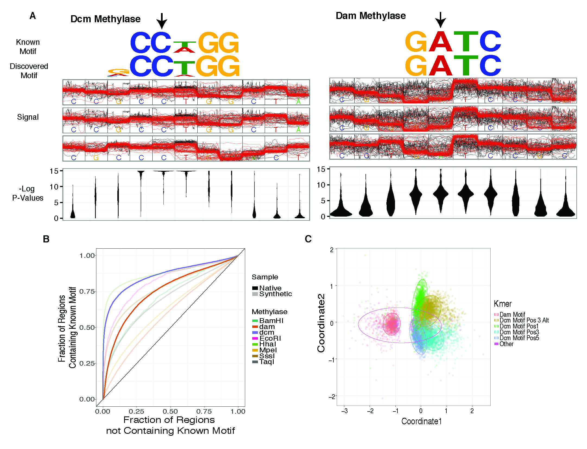
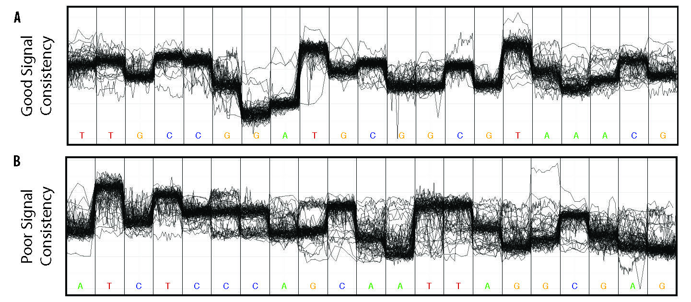
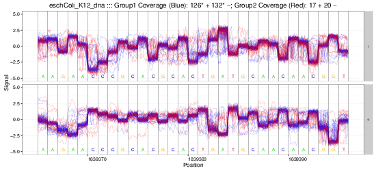

nanoraw Documentation
*********************

`nanoraw` is a python package (with command line interface) used to analyze nanopore data. This tool primarily allows for the identification of modified DNA bases by comparing native and amplified DNA samples that have been processed by nanopore sequencing. See the `nanoraw` manuscript or more details on the proof of principle for the use of nanoraw to identify modified DNA bases (`Pre-print manuscript <http://biorxiv.org/content/early/2016/12/15/094672>`_).

   
   Detection of in vivo methylated bases, as well as detect capacity and clustering based on raw signal levels.

Additionally, `nanoraw` allows for the visualization of raw nanopore signal (below) facilitated by resolving raw signal with a genomic alignment from error-prone basecalls.

   
   Example loci with good and poor signal correspondence.

The above plots as well as many others are described in the documentation here.

   
   Example gif scrolling over genomic regions (note that this is not immediately produced by nanoraw, but does not take much more effort).

.. toctree::
   :maxdepth: 2
   :caption: Table of Contents:
   
   Genome Re-squiggle and Correction Plotting <resquiggle>
   Genome Anchored Plotting <genome_plots>
   Other Plotting <other_plots>
   Auxiliary Commands <aux_commands>
