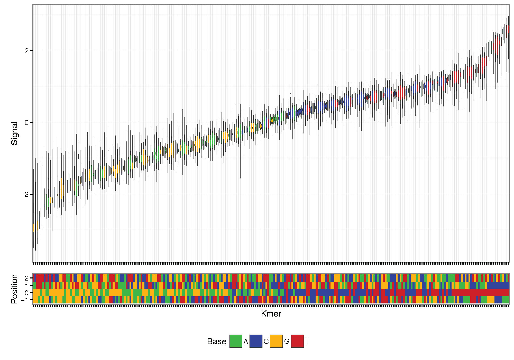
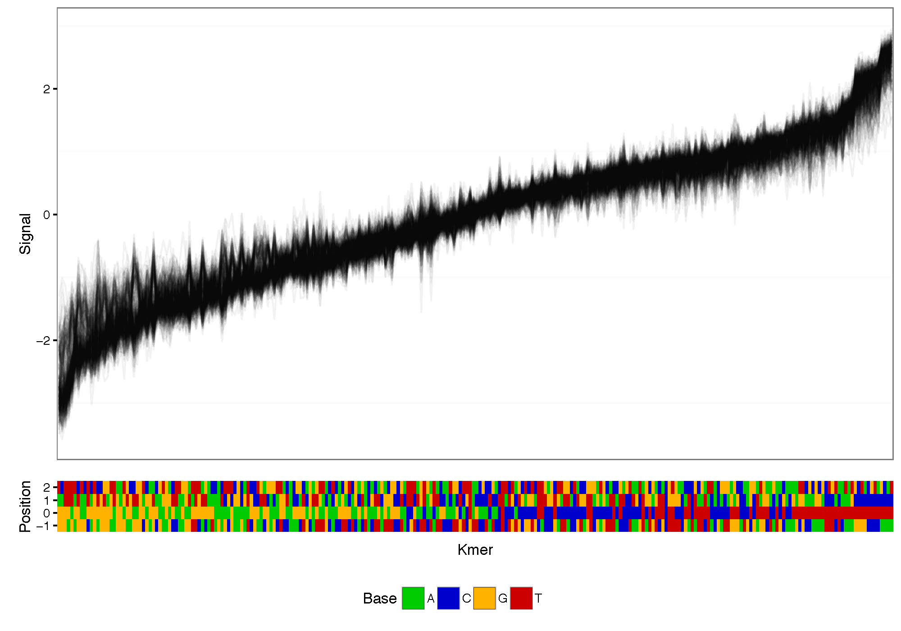
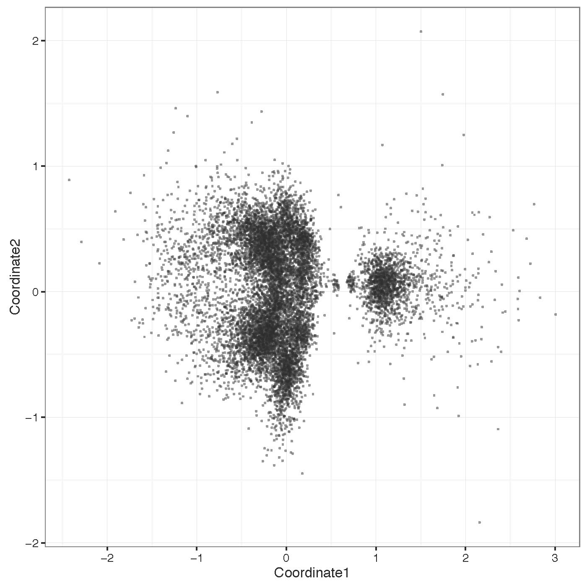

Other Plotting
**************

`plot_kmer`
-----------

Plot signal distribution acorss kmers. The command allows the selection of the number of bases up and downstream around the central genomic base.

   
   K-mer signal distribution plotting example.

   
   K-mer signal distribution connecting each read example.

`cluster_most_significant`
--------------------------

Cluster raw signal traces at bases with significant differences. Clustering is done on the difference between two runs (generally a native and amplified sample) centered on the most significantly different bases. Note that this command can be quite slow for many points, so it is advised to only use few points for plotting (<1000).

   
   Signal clustering plotting example.

Example commands
----------------

K-mer signal distribution plotting and clustering based on signal::
  
  nanoraw plot_kmer --fast5-basedirs $g1Dir
  nanoraw plot_kmer --fast5-basedirs $g1Dir --read-mean
  nanoraw cluster_most_significant --fast5-basedirs $g1Dir \
        --fast5-basedirs2 $g2Dir --2d \
        --genome-fasta $genomeFn --num-regions 100 \
        --r-data-filename testing.cluster_data.RData \
        --statistics-filename testing.significance_values.txt
