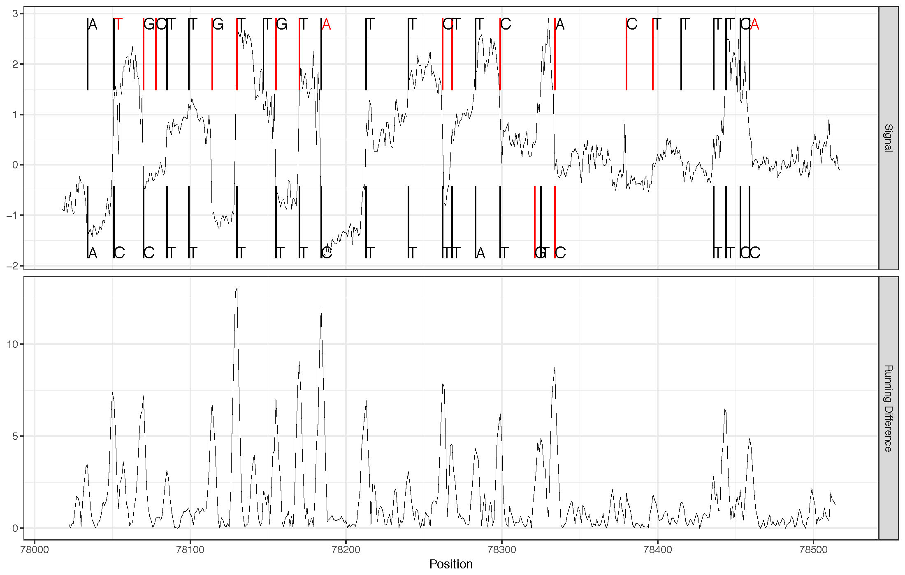
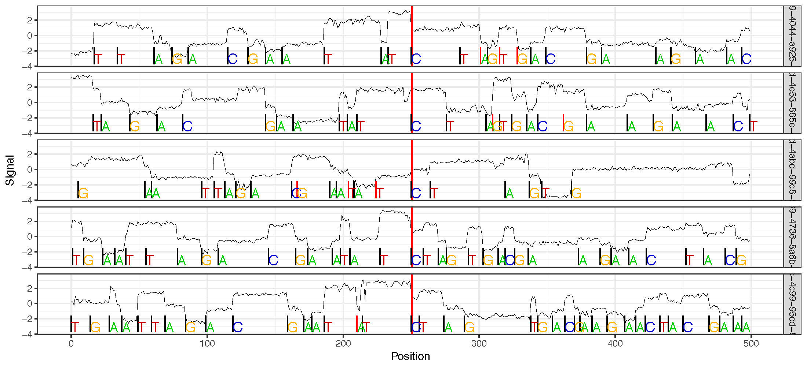

Genome Re-squiggle
******************

`genome_resquiggle`
-------------------

This command re-annotates raw signal to match continguous genomic bases with contiguous sections ("Events") of raw signal. The algorithm begins with a genomic alignment (currently graphmap) produced by the `genome_resquiggle` command. The full algorithm is described in detail within the manuscript describing nanoraw (`Pre-print manuscript <http://biorxiv.org/content/early/2016/12/15/094672>`_).

Required positional arguments for this command are (in order) `fast5_basedir` which specifies a directory containing FAST5 files to process, `graphmap_path` which is the executable path to a compiled graphmap binary (e.g. `./graphmap` if the binary is linked to the current directory), and `genome_fasta` specifying the FASTA file to which mapping should be computed.

nanoraw FAST5 format
--------------------

The result of this command is a new group/slot present in each applicable FAST5 file. This slot is specified by the `--corrected-group` option. This slot contains severl bits of information (`nanoraw_version` and `basecall_group` specified with the `--basecall-group` and also representing the ONT basecalled slot) along with slots for each 1D genome-resolved read (specified with the `--basecall-subgroups` options).

Within each basecall subgroup slot the genome-resolved read information is stored. This includes several bits of information related to the normalization used to scale the raw signal:
- shift, scale: Applied directly to the raw signal from this read in order to prodcue the normalized signal
- lower_lim, upper_lim: Used to apply winsorization to the raw signal
- norm_type: The type of normalization applied to the raw signal
- outlier_threshold: Specified outlier threshold when this read was corrected

Also stored within each basecall subgroup are datasets containing the alignment details and genome resolved events.
- Alignment: This dataset contains the `genome_alignment` and `read_alignment` which define the base-by-base genomic alignement used to start the correction process as well as the original positions of the segments (starting at the beginning of the mapped read) in the `read_segments` slot.
- Events: This dataset is similar to the ONT Events dataset providing the following data values for each genomic base: `norm_mean`, `norm_stdev`, `start`, `length`, `base`. The Events slot also contains the `read_start_rel_to_raw` bit of information indicating the 0-based index within the raw signal vector at which the mapped read starts.

The `Alignment` slot also contains several statistics from the alignment including genomic `mapped_start`, `mapped_strand`, and `mapped_chrom`, mapping statistics `num_insertions`, `num_deletions`, `num_matches`, and `num_mismatches` and finally the number of raw observations trimmed from the read by mapping `trimmed_obs_start` and `trimmed_obs_end` (soft clipped bases from mapping).

`genome_resquiggle` Options:
----------------------------

Filtering Options:
++++++++++++++++++

- `--timeout`: Timeout in seconds for the processing of a single read. This can be useful if one would like to skip reads that might take too much time to correct. Default: No timeout.
- `--cpts-limit`: Maximum number of changepoints to attempt to find within a single indel group. (Not setting this option can cause a process to stall and cannot be controlled by the timeout option). This option is also useful to filter and not correct reads that contain very error prone regions. Default: No limit.

Signal Normalization Options:
+++++++++++++++++++++++++++++

- `--normalization-type`: Type of normalization to apply to raw signal when calculating statistics based on new segmentation. Should be one of {"median", "ont", "none"}. "none" will provde the raw integer as the raw signal is stored. "ont" will calculate the pA estimates as in the ONT events mean/sd. "median" will shift by the median of each reads' raw signal and scale by the MAD. Default: median
- `--outlier-threshold`: Number of scales values (median:MADs; ont:SDs, none:SDs) at which to winsorize the raw signal. This can help avoid strong re-segmentation artifacts from spikes in signal. Set to negative value to disable outlier trimming. Default: 5

Input/Output Options:
+++++++++++++++++++++

- `--fast5-pattern`: A pattern to search for a subset of files within fast5-basedir. Note that on the unix command line patterns may be expanded so it is best practice to quote patterns.
- `--overwrite`: Overwrite previous corrected group in FAST5/HDF5 file. WARINGING: Use caution when setting this option that the `--corrected-group` is not set to the group containing the original basecalling information. Note this only effects the group defined by `--corrected-group`.
- `--failed-reads-filename`: Output failed read filenames into a this file with assoicated error for each read. Default: Do not store failed reads. This can be useful in order to track down some failure modes.

Multiprocessing Option:
+++++++++++++++++++++++

- `--processes`: Specify number of processors to use. Mutliprocessing is currently carried out over each read using a single queue of all the reads.

Re-segmentation Option:
+++++++++++++++++++++++

- `--use-r-cpts`: Use R changepoint package to determine new event delimiters. (requires rpy2, R and R package "changepoint" to be installed). Note that this option may not be available in the future.

Correction Plotting
-------------------

In order to interrogate and better understand the genome re-squiggle process two plotting commands are provided (`plot_correction` and `plot_multi_correction`).

`plot_correction`
+++++++++++++++++

This command shows the read correction process for a small region of a single read. In the upper panel are the original ONT (or potentially other) basecalls (along the top of the panel) and the genomic basecalls (along the bottom of the panel) with the raw (normalized) signal shown throughout the middle of the plot. Original basecalls that were inserted are shown in red and similarly genomic bases that were deleted in the original basecalls are shown in red. Mismatched basecalls are also shown in red (at the top of the panel. The lower panel shows the moveing difference used (by default) to compute the new breakpoints when needed near indels.

   
   Read correction example plot.

`plot_multi_correction`
+++++++++++++++++++++++

This plot shows multiple reads in "sequencing time space" (x-axis) anchored at a single position (either chosen randomly or specified). This plot is useful for interogatting the raw sequencing signal at particular regions of interest. This plot can optionally include the original basecalls as well, but the plot can become quite cumbersome with lots of information.

   
   Mutliple read correction example plot.
